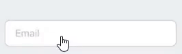

# react-native-input-outline

A react-native component that uses a customized text input.

## Installation

    $ npm i --save react-native-input-outline

or

    $ yarn add react-native-input-outline

## Usage

This component inherits props from TextInput in the standard React-Native library, so you can essentially use it in the same way that you would use that TextInput. However, you can configure the colors, and the placeholder, and the overall styling if you wish, however the whole point of this component is so you don't have to do any styling yourself.

    import InputOutline from 'react-native-input-outline';

    <InputOutline
      placeholder="Email"
      focusedColor='blue'
      defaultColor='grey'
    />

## Props

|            Prop | Description                                                                        | Default                                                                         |
| --------------: | :--------------------------------------------------------------------------------- | :------------------------------------------------------------------------------ |
| Inherited Props | Any prop from React-Native TextInput                                               | [TextInput Props](https://facebook.github.io/react-native/docs/textinput#props) |
|     placeholder | The label/placeholder that will display giving information about your input field. | _String_("Placeholder")                                                         |
|    focusedColor | The color that shows when the input is focused.                                    | _String_("blue")                                                                |
|    defaultColor | The color that shows when the input is empty and not focused.                      | _String_("#c5b4b8")                                                             |
